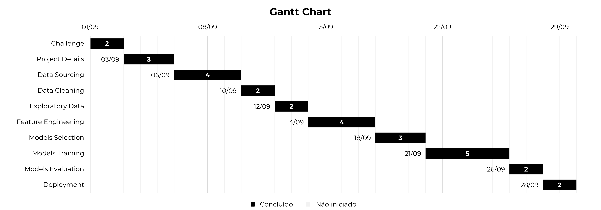

# Ciência de Dados - Projeto Final 5

## Projeto
Modelos de clusterização e classificação para segmentação de clientes em campanhas de marketing em uma plataforma de delivery

## Objetivo
O objetivo do projeto é, a partir de uma campanha piloto, construir um **modelo de clusterização** para segmentação de clientes em campanhas de marketing em uma plataforma de delivery. De forma que o modelo preveja o comportamento dos clientes e torne possível aplicá-lo ao restante da base de clientes, permitindo à empresa selecionar os clientes que têm maior probabilidade de adquirir a oferta, visando ter campanhas de marketing altamente lucrativa. E em seguida, construir um **modelo de classificação** de acordo com os resultados obtidos no modelo inicial para fazer a segmentação dos futuros clientes da empresam, seguindo os mesmos propósitos.

## Descrição
............................

## Metodologia 5W2H
|**Questionamento** |**Descrição**|
|---------|-------|
|**What?** O que? | ............................|
|**Where?** Onde? |............................|
|**When?** Quando? | ............................|
|**Who?** Quem? | ............................|
|**Why?** Por quê? | ............................|
|**How?** Como? | ............................|
|**How Much?** Quanto? | ............................|

## Referências
- **Repositório do desafio:** https://github.com/ifood/ifood-data-business-analyst-test

## Bibliotecas
- **Matplotlib:** https://matplotlib.org/
- **NumPy:** https://pandas.pydata.org/docs/index.html
- **Pandas:** https://pandas.pydata.org/docs/index.html
- **Scikit-Learn:** https://seaborn.pydata.org/
- **Seaborn:** https://seaborn.pydata.org/

## Estrutura do Projeto
- **.venv/:** Pasta destinada a armazenar o ambiente virtual do projeto se necessário
- **data/:** Pasta destinada a armazenar as versões dos datasets
    - **final/:** Pasta destinada a armazenar os datasets finalizados após todos os tratamentos necessários
    - **processed/:** Pasta destinada a armazenar os datasets que já tiveram algum tratamento
    - **raw/:** Pasta destinada a armazenar os datasets brutos e que ainda não foram processados
- **deploys/:** Pasta destinada a armazenar os deploys do projeto, em formatos ipynb, py, executável e Streamlit (.py)
- **docs/:** Pasta destinada a armazenar os arquivos e documentos referentes ao projeto
- **functions/:** Pasta destinada a armazenar arquivos com as funções dos projetos de ciência de dados
    - `__init__.py`: Arquivo para indicar que a pasta é um pacote/biblioteca
    - `fn_charts.py`: Arquivo de funções para criar gráficos recorrentes
    - `fn_libraries.py`: Arquivo de funções para importação das bibliotecas
    - `fn_stats.py`: Arquivos de funções para criar análises estatísticas recorrentes
- **images/:** Pasta destinada a armazenar imagens do projeto
    - **illustrations/:** Pasta destinada a armazenar imagens de referência que foram utilizadas durante o projeto
    - **outputs/:** Pasta destinada a armazenar imagens geradas durante o projeto, como gráficos e visualizações
- **models/:** Pasta destinada a armazenar os modelos criados durante o projeto
- **notebooks/:** Pasta destinada a armazenar os notebooks de cada etapa do projeto de ciência de dados
    - `01_ challenge.ipynb`: Arquivo dedicado a etapa de Definição do Desafio ou Challenge
    - `02_project_details.ipynb`: Arquivo dedicado a etapa de Detalhamento do Projeto ou Project Details
    - `03_data_sourcing.ipynb`: Arquivo dedicado a etapa de Obtenção dos Dados – Data Sourcing
    - `04_data_cleaning.ipynb`: Arquivo dedicado a etapa de Tratamento dos Dados ou Data Cleaning
    - `05_exploratory_data_analysis.ipynb`: Arquivo dedicado a etapa de Análise Exploratória ou Exploratory Data Analysis 
    - `06_feature_engineering.ipynb`: Arquivo dedicado a etapa de Modelagem dos Dados ou Feature Engineering
    - `07_models_selection.ipynb`: Arquivo dedicado a etapa de Seleção dos Modelos – Models Selection
    - `08_models_training.ipynb`: Arquivo dedicado a etapa de Treinamento dos Modelos – Models Training
    - `09_models_evaluation.ipynb`: Arquivo dedicado a etapa de Validação do Modelo – Models Evaluation
    - `10_deployment.ipynb`: Arquivo dedicado a etapa de Deploy em Produção – Deployment
- **params/:** Pasta destinada a armazenar as constantes e variáveis globais do projeto
    - `__init__.py`: Arquivo para indicar que a pasta é um pacote/biblioteca
    - `consts.py`: Arquivo para a armazenar as constantes globais do projeto
    - `vars.py`: Arquivo para a armazenar as principais variáveis do projeto
- **presentations/:** Pasta destinada a armazenar as apresentações do projeto, em PowerPoint e PDF
- **references/:** Pasta destinada a armazenar arquivos com informações do projeto, como dicionário de dados, cronograma
- **reports/:** Pasta destinada a armazenar relatórios criados durante o projeto, em HTML, pela biblioteca y data profiling
- `.env`: Arquivo para armazenar as variáveis de ambiente sensíveis do projeto, como usuários, senhas, tokens e chaves de API
- `.gitattributes`: Arquivo para configurar o repositório e omitir arquivos sem utilidades da versão final do projeto
- `.gitignore`: Arquivo para ignorar determinados arquivos ao subir o projeto para o Github
- `LICENSE`: Arquivo com a licença do projeto
- `README.md`: Arquivo para resumir e apresentar o projeto
- `requirements.txt`: Arquivo para listar as dependências/bibliotecas necessárias no projeto

## Etapas do Projeto
- **01. Definição do desafio – Challenge:** Explica detalhadamente qual é o desafio que está se buscando resolver. Pode ser aplicado o método 5W2H
- **02. Detalhamento do Projeto – Project Details:** Detalha e explica todas as informações dos datasets e gera um arquivo inicial de análise, y data profiling
- **03. Obtenção dos Dados – Data Sourcing:** Realiza a obtenção dos dados para o projeto
- **04. Tratamento dos Dados – Data Cleaning:** Realiza o tratamento dos dados para eliminar qualquer tipo de anomalia, como dados vazios, duplicados, etc
- **05. Análise Exploratória – Exploratory Data Analysis (EDA):** Faz a análise exploratória dos dados para um entendimento melhor do projeto
- **06. Modelagem dos Dados – Feature Engineering:** Realiza os ajustes necessários nos dados para que os algoritmos de machine learning possam ser aplicados
- **07. Seleção dos Modelos – Models Selection:** Seleciona os algoritmos de aprendizado de máquina que serão aplicados
- **08. Treinamento dos Modelos – Models Training:** Realiza o treinamento dos modelos de aprendizado de máquina selecionados
- **09. Validação do Modelo – Models Evaluation:** Faz a validação do modelo selecionado com base nos resultados das métricas de avaliação e define qual(is) modelo(s) será colocado em produção
- **10. Deploy em Produção – Deployment:** Coloca o modelo definido em produção

### Cronograma do Projeto - Gráfico de Gantt

## Resultados
...........................